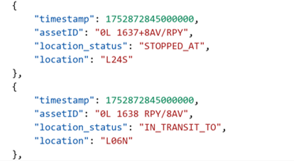

# NYC MTA Subway Real-Time Digital Twin
## Table of Contents
* [Overview](#overview)
* [Process](#process)
* [1. Digital Twin Definition](#1-digital-twin-definition)
  * [1.1 Assets](#11-assets)
  * [1.2 Attributes](#12-attributes)
  * [1.3 Data Enrichment/Derived Attributes](#13-data-enrichmentderived-attributes)
  * [1.4 Hierarchies](#14-hierarchies)
  * [1.5 Scripts](#15-scripts)
* [2. Live Project](#2-live-project)
  * [2.1 MTA API Query](#21-mta-api-query)
  * [2.2 Incoming Data Processing, with Python](#22-incoming-data-processing-with-python)
  * [2.3 Output to CAS Tables](#23-output-to-cas-tables)
* [3. Visualization](#3-visualization)
  * [3.1 Data Post-Processing](#31-data-post-processing)
  * [3.2 Dashboard](#32-dashboard)
* [Additional Resources](#additional-resources)
  

## Overview

This project creates a digital twin of the NYC MTA Subway system to monitor real-time operations using publicly available transit data. It delivers the following real-time performance metrics through a SAS Visual Analytics dashboard:
<ul>
  <li>Number of trains currently underway</li>
    <li>Number of trains stopped at stations</li>
    <li>Number of trains in transit</li>
  <li>Average transit time between stations</li>
  <li>Average time stopped at a station</li>
</ul>

To recreate the project configuration files, import the [full_project_details.json](full_project_files/full_project_details.json) into AutoMLForIoT. Also explore the [full_model.xml](full_project_files/full_model.xml) file to view the entire ESP project.  

## Process
This project begins with configuration files that describe the subway's digital twin structure. Then, it leverages **AutoMLForIoT** to convert the files into a **SAS Event Stream Processing** project. This ESP project queries live train status from the **MTA API** every 30 seconds and outputs the processed data to **CAS** tables. A **Visual Analytics** dashboard uses this updated data to display dynamic performance metrics for the following: wait times at stations, transit durations between stops, delay number and duration.    
    

Below, see a screenshot of the Visual Analytics dashboard, showing the performance metrics.    
  

## 1. Digital Twin Definition
The first step of this project is defining the digital twin. This definition is broken up into three main portions: assets, attributes, and hierarchies. In the diagram below, observe two station assets and one train asset. They are connected through a hierarchy and display information about the attributes associated with each in the grey boxes.   

   

The information about the subway system comes from a Python library called [NYCT-GTFS](https://github.com/Andrew-Dickinson/nyct-gtfs/tree/master). This library provides an interface for working with NYC Subway data and also contains static files that describe the system's stops, routes, stop times, and more. To view all the files from the NYCT-GTFS library, visit the [subway_data folder](digital_twin_definition/subway_data).

### 1.1 Assets
Assets are individual items in the system. In the subway system, the assets are individual subway trains, stations, and tracks between stations. The full list of assets was created using the [stop_times.txt](digital_twin_definition/subway_data/stop_times.txt), [stops.txt](digital_twin_definition/subway_data/stops.txt), and [trips.txt](digital_twin_definition/subway_data/trips.txt) files.  

To see a full list of asset types, open the [assetTypes.json](digital_twin_definition/config_files/assetTypes.json) file. To see a full list of all assets, visit the [assets.json](digital_twin_definition/config_files/assets.json) file.

### 1.2 Attributes
Attributes are details of interest that describe an asset. Attributes that describe subway trains include the route, train destination, and time of departure. Stations have attributes describing route, location using latitude/longitude, and most recent train arrival. A track has attributes describing its route, location using latitude/longitude, and the most recent train to begin on the track.  

For a full list and description of attributes, see the [attributes.json](digital_twin_definition/config_files/attributes.json) file. To see a list of static (unchanging) attributes for tracks and stations, see the [staticAttributes.json](digital_twin_definition/config_files/staticAttributes.json) file. This file describes the latitude, longitude, and route for each track and station.

### 1.3 Data Enrichment/Derived Attributes
The basic attributes covered in the section above come directly from the raw data. However, in many cases, we want to calculate new measures that look back in time, aggregate across connected assets, and/or execute code based on one or many attributes. Some examples of derived attributes for a train include its latitude and longitude, which changes based off the station or track where it is currently located. A track has derived attributes calculating the travel time of the last train that traveled through it. It may be useful for a station to have information about the previous track, to determine the next incoming train.  

See the [data_enrichment](digital_twin_definition/data_enrichment/) folder for more information about the derived attributes. The [derivedAttributes.json](digital_twin_definition/data_enrichment/derivedAttributes.json) file contains a list of all derived attributes. The [derivedAttributeDetails](digital_twin_definition/data_enrichment/derivedAttributeDetails) folder contains details describing how each derived attribute is calculated, partitioned by type of derived attribute. The [userDefinedCode](digital_twin_definition/data_enrichment/userDefinedCode) folder contains all of the code associated with code-type derived attributes.

### 1.4 Hierarchies
Hierarchies describe how assets are connected to each other. In one hierarchy structure, there is one parent that can have one or more child, and then the children can act as parents for the next level of the hierarchy, and so forth. The project can have multiple hierarchies. For the subway project, we created 12 separate hierarchies, each describing how the stations and tracks for one train route relate to one another.    

For a full list of hierarchies, see the [hierarchyList.json](digital_twin_definition/config_files/hierarchyList.json) file. To see the hierarchy map described in json, see the [hierarchyMap.json](digital_twin_definition/config_files/hierarchyMap.json) file. To see interactive diagrams of the hierarchy maps, go to the [hierarchy_maps_html](digital_twin_definition/config_files/hierarchy_maps_html) folder, download one or more files, and open the file(s) in a web broswer. The html file diagram will show the structure of the entire hierarchy and includes a list of attributes for each asset, visible on hover.

### 1.5 Scripts
To convert the information from the .txt formats seen in the [subway_data](digital_twin_definition/subway_data) folder into the .json files seen in the [config_files](digital_twin_definition/config_files/) folder, the following scripts were used, in this order:
1.  [getMTAdata_updated.sas](digital_twin_definition/scripts/getMTAdata_updated.sas) creates a list of all unique stations within the subway system. It merges information about each station, its route, and its location into one condensed dataset.
2. [getEnrouteToLocs.sas](digital_twin_definition/scripts/getEnrouteToLocs.sas) creates the latitudes and longitudes for each track between stations. This information was not provided directly by any files and involved calculations to get a location that is 1/3 through the route, then 2/3 through the route. By creating two different points along the track, the dashboard is able to visualize which train is ahead of another if there are multiple on the same track at one time.
3. [asset_creator.sas](digital_twin_definition/scripts/asset_creator.sas) pulls together the various datasets and creates the final .json files.  

## 2. Live Project
The Event Stream Processing (ESP) project queries the MTA API every 30 seconds, processes the data, and outputs the data to CAS tables. The ESP project was created using AutoMLForIoT, which uses information from the digital twin definition to build a project. Below, observe a diagram of the entire ESP project.    
    

Below, observe a short video showing the location and some individual windows of the ESP project. 
🎥 [ESP Project Video](videos/ESPStudioProjectDemo.mp4)    

### 2.1 MTA API Query
The Metropolitan Transportation Authority is responsible for public transport in New York City. The MTA provides various data feeds accessible via API for the [subway](https://api.mta.info/#/subwayRealTimeFeeds), [Long Island Railroad](https://api.mta.info/#/lirrFeeds), and [Metro-North Rail](https://api.mta.info/#/mnrFeeds) transit systems. Use of the API does not require accounts or API keys.  

The [NYCT-GTFS](https://github.com/Andrew-Dickinson/nyct-gtfs/tree/master) Python library is an interface for subway data published by the MTA. This library parses the information received from the MTA and simplifies the querying process. 

### 2.2 Incoming Data Processing, with Python
Data from the NYCT-GTFS call comes in as a .json format, seen below. The query updates show the current location and status of each train, along with other static information such as the final destination and expected route completion time.    
    

However, the data needs to be processed before outputting to CAS. It needs to be reformatted and processed so any changes in individual trains are registered properly. Below, observe the format that is output to CAS.    
    

A Python script processes the incoming data and keeps track of the trains currently in the system. If an update concerns a newly seen train, the script will initialize a Train object to keep track of its location and status changes. If an update involves a train we have seen before, the script compares the location and status of the new update to determine if there have been any changes. For example, if the last update showed the train had a stopped status, and now it shows an in-transit status, the new processed output will indicate that the train has departed. The script also detects when a train has reached its destination stop, sending an update that indicates the ESP project should delete this specific train asset.  

Find the full Python script in the [api_query_processing.py](esp_project/api_query_processing.py) script. Note this script is originally built to work within ESP and references ESP-specific items. This script is a part of the customSource.xml file in AutoMLForIoT, and is located within the gtfs_pulse window in the ESP project.

### 2.3 Output to CAS Tables
After processing, the data is output to three different CAS tables for data storage. These tables are divided by asset type, so there is a Train, Station, and Track table. Below, observe a video of a live ESP project and the activity in each output window. 
 🎥 [Live ESP Project Walkthrough](videos/StationsRecording.mp4) 

Here, observe a video of a live ESP project and its output when a train completes its route. 
 🎥 [Live ESP End of Route Recording](videos/TrainEndOfRouteRecording.mp4) 

Also observe static examples of each table below.   
   
   
    

These tables are accessible via SAS Studio and are backed up every five minutes to prevent large data loss. Find the script to back up the tables in the [backup_cas_datasets.sas](esp_project/backup_cas_datasets.sas) script.  

## 3. Visualization
The final Visual Analytics (VA) dashboard pulls information from the output CAS tables. Since there are three different data tables, the data needs to be processed and joined together to create the final VA-ready dataset.

### 3.1 Data Post-Processing
Since the dashboard shows only the most recent data, the datasets must first be filtered to contain only the most recent update period. Then, some additional binary features are added to the dataset such as inTransit or Delayed. These features allow the dashboard to display aggregated metrics.  

Then, the datasets are combined with another [mta_routes](images/mta_routes_table.jpeg) table to add longer route names to the assets for easier filtering. These datasets are then all merged with each other and another [mta_line_data](images/mta_line_data_table.jpeg) dataset which contains information about the entire route. This line dataset allows us to display the entire route as a line and then overlay the trains and stations on top.  

See the [create_mta_map.sas](post_processing/create_mta_map.sas) script for more details about the post-processing process. Observe the calculation process for the number of trains in transit vs stopped, and for the number of current delays.

### 3.2 Dashboard
The dashboard consists of three main parts: key performance metrics, an interactive subway map, and a route filtering menu. Observe the components below, outlined in red boxes.   
    

The **performance metrics** cover the following: 
- total trains active
    - total trains currently in transit
    - total trains currently stopped at a station
- average station wait time
- average between-station transit time
- number of current delays
- percentage of delayed trains
- average delay time.

Note that the percentage of delayed trains is calculated in Visual Analytics rather than in the data post-processing step. To achieve this, I created new data items that sum the number of active delays and the number of active trains. Then I created a calculated variable that divides the number of delays by the number of trains.  

The **interactive subway map** shows the route line, trains, and stations for each route selected. Route lines appear in different colors, all stations appear as yellow circles, and all trains appear as black subway icons. Below, see an expanded subway map view.   
   

The map also provides information about individual trains and stations on hover. Below, observe information about one train and two stations at the same location.   
    

The **route filtering menu** shows a list of all available routes. Users can select one or more routes, and the information in both the performance metrics and on the subway map will update accordingly. Below, observe the route filtering menu.   
   

The following video demonstration shows the live dashboard as it updates. It also explores each of the dashboard components, showing them in action in a real-time environment. 
 🎥 [Live MTA Dashboard](videos\mta_dashboard_final.mp4)  

## Additional Resources
Find Hanwen Zhang's video presentation of the full MTA project below. This is a short explanation of the project overview, process, and main components. 
 🎥 [MTA Project Presentation](videos/mta_project_final_presentation.mp4)